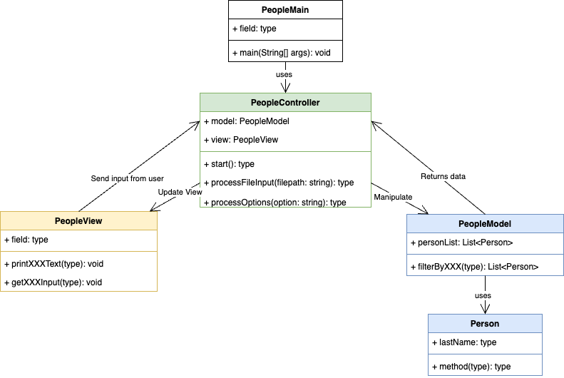

# QueryPeople
QueryPeople is a text UI application which can parse a file and query the resulting data.

The program will read various comma-separated variables (csv) file which contains (fake!) data for a number of people with follow fields:
First name, Last name, Company, Address, City, Country, Postal, Phone1, Phone2, Email, Web. 

## UML diagram
### Class Diagram:


### How to run Unit Test:
```
mvn clean test
```

### How to run Main program:
1. Run the PeopleMain to start the application
```
mvn compile exec:java -Dexec.mainClass="PeopleMain"
```
2. Input the file path which contains the data.
3. Input the option 1-6 to query the data in the file.
4. Result will be displayed based on the option selected.

### Assumptions:
1. The file provided is valid csv file

### Future thoughts
1. Support multiple csv files
2. 
